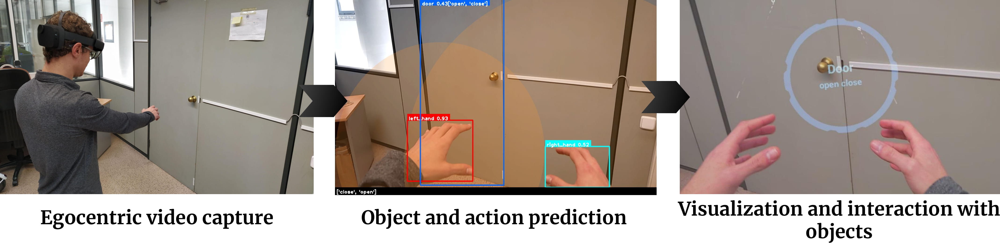

# Holo YOLO

In this work, we propose an AR system for detecting early signs of dementia
by recognizing human-object interactions with the combination
of the HoloLens 2 and, an existing action estimation architecture
based on the simultaneous detection of the hands and the objects
in the current scene using YOLO.



## How to use  

First, install Unreal Engine 4, version 2.27 or upper.

```bash
# clone project   
git clone https://github.com/3dperceptionlab/HoloYOLO.git
```

## Authors

This project has been carried out as an end-of-degree project by:
- David Mulero Pérez ([dmulero@dtic.ua.es](mailto:dmulero@dtic.ua.es))
- Manu Benavent Lledó ([mbenavent@dtic.ua.es](mailto:mbenavent@dtic.ua.es))