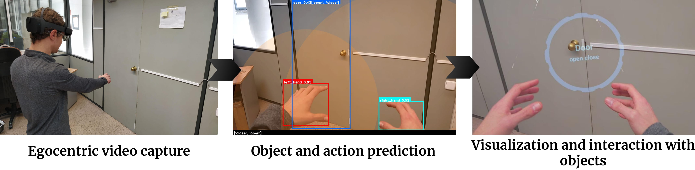

# Holo4Care

In this work, we propose an AR system for detecting early signs of dementia
by recognizing human-object interactions with the combination
of the HoloLens 2 and, an existing action estimation architecture
based on the simultaneous detection of the hands and the objects
in the current scene using YOLO.



## How to use  

First, install Unreal Engine 4, version 2.27 or upper.

```bash
# clone project   
git clone https://github.com/3dperceptionlab/Holo4Care.git
```

Compile to generate Visual Studio solution files. To deploy in the device, generate the package and upload (.appxbundle and select "Allow me to select framework packages" and upload the .appx file) to the Mixed Reality Portal.
If it is the first time, you will need to generate a key. To do so, in UE4, access Edit>Project Settings>Platform>HoloLens, in Packaging/Signing Certificate: Generate New.

## Source code in `Source/HoloYOLO`

This folder contains the C++ components that orchestrate image capture, data transmission, and prediction visualisation inside Unreal Engine:

### `HoloYOLO.cpp`
- Registers the project’s primary module through `IMPLEMENT_PRIMARY_GAME_MODULE`, giving Unreal the entry point it needs to load the game.

### `HoloYOLOGameModeBase.cpp`
- Declares the base game mode. The class itself is minimal because runtime logic is delegated to specialised actors such as the HTTP interface and the prediction objects.

### `HTTPInterface.cpp`
Actor in charge of talking to the REST API that processes the frames captured by HoloLens.

- `MakePost(UTextureRenderTarget2D*, FString, int)`: exports the camera render target to PNG with `FImageUtils::ExportRenderTarget2DAsPNG`, Base64-encodes the buffer, and builds a `multipart/form-data` payload via `AddData`. It sends the `POST` request to the configured endpoint and starts a timing trace for debugging.
- `AddData` and `FStringToUint8`: helper utilities that wrap each field of the payload using the boundary markers required by the multipart protocol.
- `OnResponseReceived(...)`: handles the `POST` response. When the server returns a JSON containing a `get` URL, the method enqueues that endpoint so predictions can be pulled later.
- `GetJSONItems()`: dequeues pending URLs, issues the corresponding `GET` requests, and inspects HTTP status codes. A `200 OK` response passes control to `ProcessJSONtoObject`, which spawns actors for each detection.
- `ProcessJSON(...)` and `ProcessJSONtoObject(...)`: parse the prediction JSON into either lists of positions or fully fledged `APredictionObject` instances populated with class labels, actions, and bounding boxes. `ProcessJSONtoObject` also configures their visuals and refreshes the `predictionObjects` array.
- `AddNewPredictionObjets(...)`: merges newly spawned detections with previously spawned ones, scales widgets according to camera distance, keeps visibility in sync, and prunes stale actors to keep the collection bounded.

Taken together, this actor drives the entire data loop: capture the render target, post it to the backend, wait for the result URL, and rebuild the scene with the received predictions.

### `PredictionObject.cpp`
Defines the visual actor that represents each prediction in the 3D scene.

- Constructor: creates the mesh (`UStaticMeshComponent`) and text (`UTextRenderComponent`) elements, wiring them to a tactile `UUxtPressableButtonComponent` that toggles visibility.
- `ConfigNode()`: cleans up the label text (`getCleanText`), adjusts scale/offset for the text components, and shows up to two lines of suggested actions.
- `onButtonPressed`, `onButtonBeginFocus`, `onButtonEndFocus`: handle user interaction (toggle action visibility and recolour the node when the user focuses it).
- `destroy()`: safe wrapper around `Destroy()` used by `HTTPInterface` when recycling actors.

### `NetInterface.cpp`
Actor devoted to low-level TCP socket experiments. It lets you send or receive images outside the HTTP workflow.

- `CreateServer()` and `CreateClient()`: configure sockets, apply options such as `SO_REUSEADDR` and `SO_REUSE_UNICASTPORT`, and bind/connect to the configured IP and port.
- `SendImage()`: reads a local file (`test.png`), sends its size first, and then streams the raw bytes to the connected server.
- `ReceiveImage()`: accepts inbound connections, rebuilds the received byte buffer, and saves it to disk (`test_server.png`).
- `BeginPlay()` and `EndPlay(...)`: initialise the instance as either server or client depending on `IsRunningDedicatedServer()` and close sockets cleanly on shutdown.

### `PythonAPI.cpp`
Provides static helpers for integrating external scripts and pipelines.

- `ExecuteSystemCommand(...)`: launches operating system processes via `FPlatformProcess::ExecProcess` and returns the captured standard output.
- `LoadFile(...)`: reads binary files from disk into a `TArray<uint8>` (used for textures produced by Python routines).
- `SendDataToServer(...)` and `ReceiveDataFromClient(...)`: early sketches of Unreal networking (`UNetConnection`) integration for sharing textures between client and server.
- `SaveTextureToArchive(...)`, `LoadTextureFromArchive(...)`, and `SaveTextureToFile(...)`: serialise `UTexture2D` assets to binary streams so they can be transmitted or persisted.

### How the pieces fit together
1. `HTTPInterface` captures the current frame, uploads it to the API, and requests the results.
2. When detections arrive, `ProcessJSONtoObject` spawns `PredictionObject` actors that display class labels and suggested actions in 3D.
3. `NetInterface` and `PythonAPI` offer alternative ways to move data around (raw sockets and external processes) for experimenting with AI pipelines outside the engine.

## Authors
- Manuel Benavent-Lledo ([mbenavent@dtic.ua.es](mailto:mbenavent@dtic.ua.es))
- David Mulero-Perez ([dmulero@dtic.ua.es](mailto:dmulero@dtic.ua.es))
