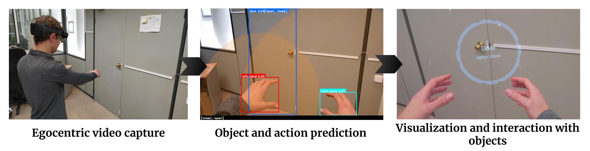

# Holo YOLO

In this work, we propose an AR system for detecting early signs of dementia
by recognizing human-object interactions with the combination
of the HoloLens 2 and, an existing action estimation architecture
based on the simultaneous detection of the hands and the objects
in the current scene using YOLO.



## How to use  

First, install Unreal Engine 4, version 2.27 or upper.

```bash
# clone project   
git clone https://github.com/3dperceptionlab/HoloYOLO.git
```

Compile to generate Visual Studio solution files. To deploy in the device, generate the package and upload (.appxbundle and select "Allow me to select framework packages" and upload the .appx file) to the Mixed Reality Portal.
If it is the first time, you will need to generate a key. To do so, in UE4, access Edit>Project Settings>Platform>HoloLens, in Packaging/Signing Certificate: Generate New.

## Authors
- Manuel Benavent-Lledo ([mbenavent@dtic.ua.es](mailto:mbenavent@dtic.ua.es))
- David Mulero-Perez ([dmulero@dtic.ua.es](mailto:dmulero@dtic.ua.es))
